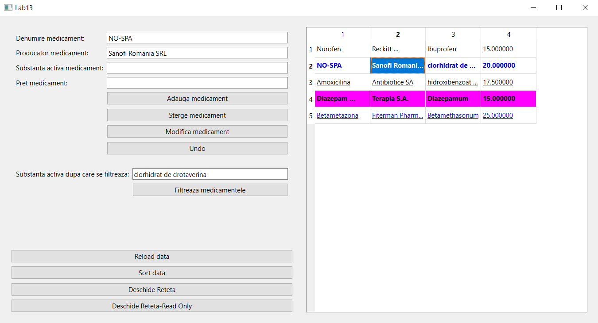
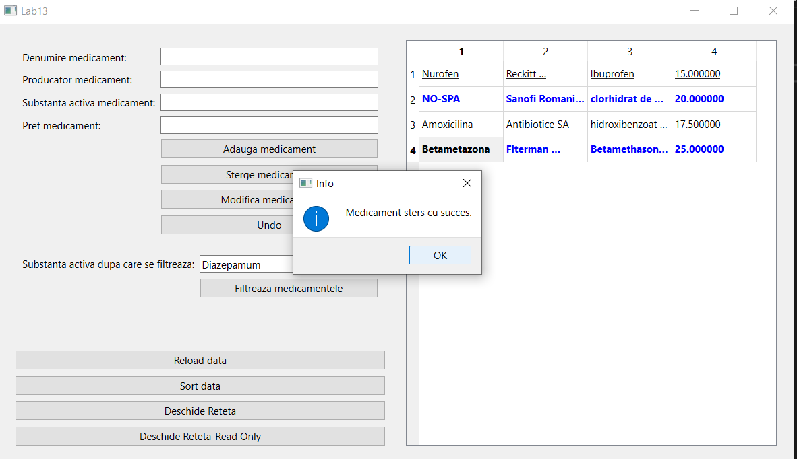
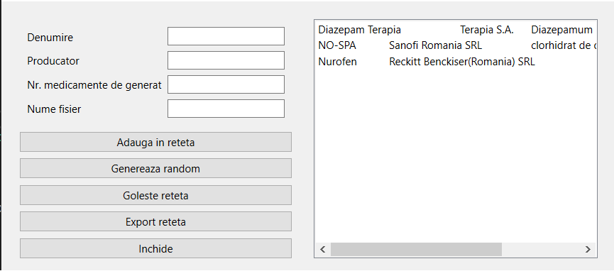

# Pharmacy-OOP
Pharmacy app design using OOP principles and Qt framework

1. The approach used to make this project was Test Driven Development
2. Layerd Arhitecture 
    - Domain
    - Repository  
    - Service
    - View
3. Notable design patterns
    - Command design ( illustrated with Undo functionality where i declared a abstract class UndoAction and 3 inheriting classes UndoAdd, UndoDelete, UndoUpdate)
    - Observer pattern ( Changes inside the Recepy class should be visible to all new application windows)
    - Model-View-Controller ( A class is resposible to get the data from Repository and to pass it to the user depending on his request (don't load all entities at the start of app))

